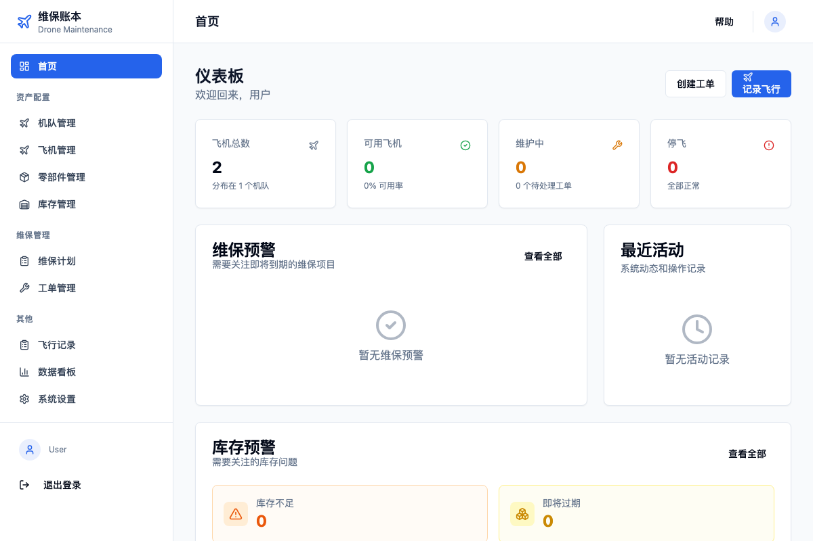
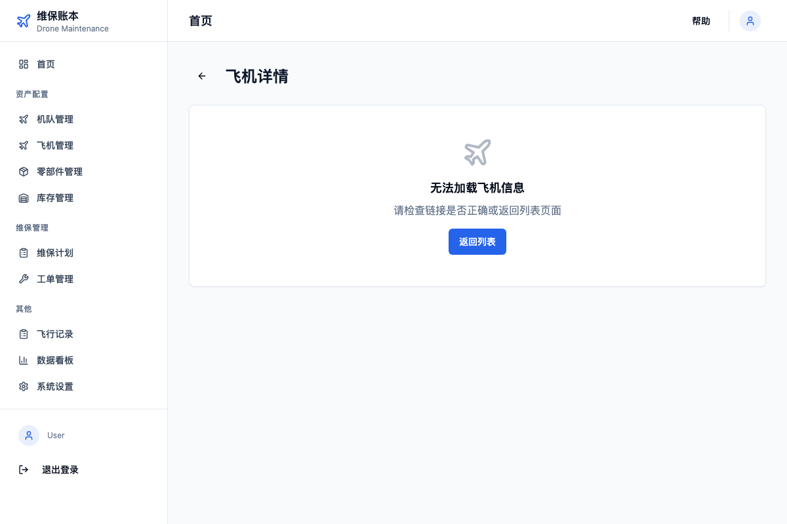
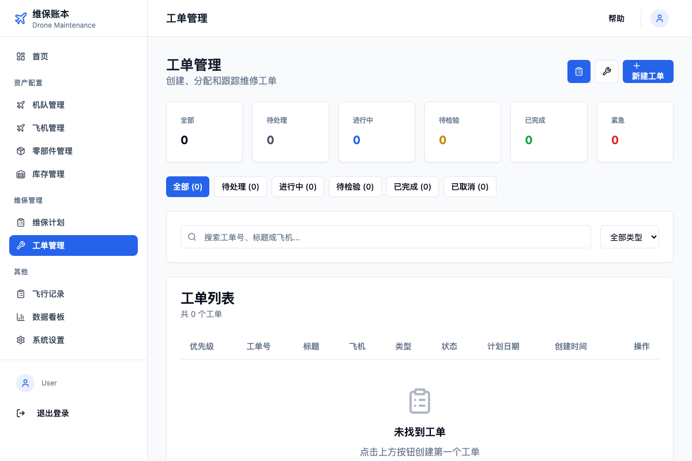
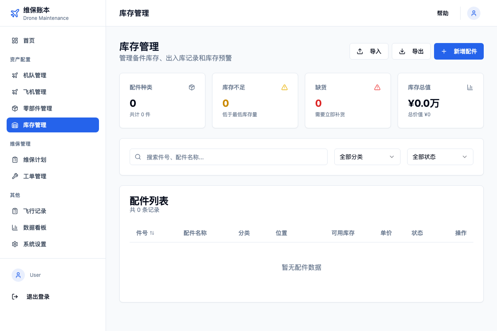
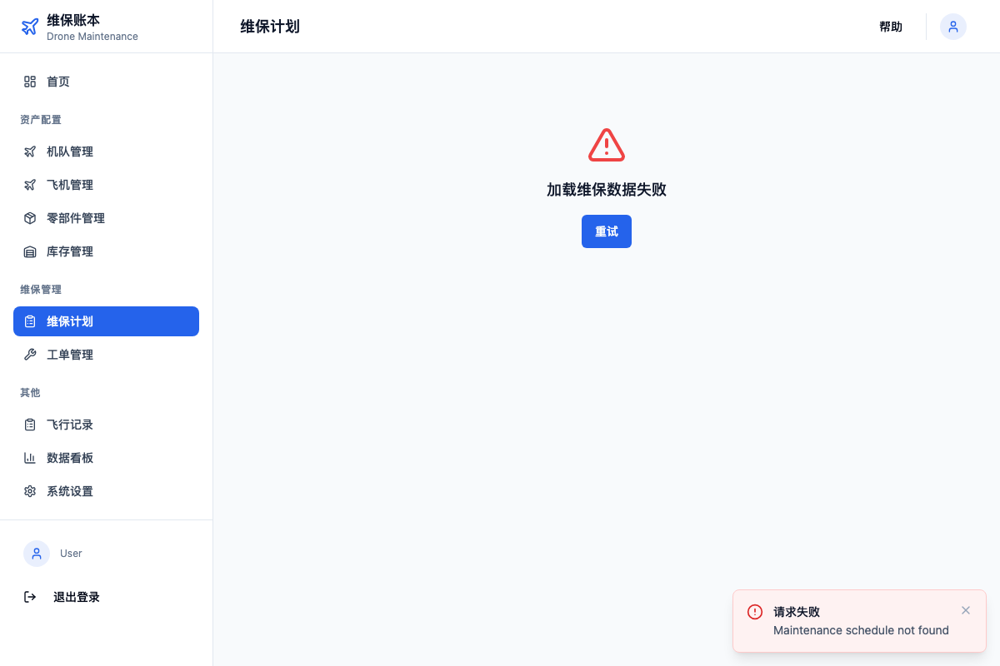

<p align="center">
  
</p>

<h1 align="center">DroneMaintenance-Ledger</h1>

<p align="center">
  <strong>低空飞行器的"电子病历"系统</strong>
</p>

<p align="center">
  面向无人机和 eVTOL 的开源 MRO（维护、维修、运行）管理平台
</p>

<p align="center">
  <a href="#快速开始">快速开始</a> •
  <a href="#核心功能">核心功能</a> •
  <a href="#技术架构">技术架构</a> •
  <a href="#API-文档">API 文档</a> •
  <a href="#部署指南">部署指南</a> •
  <a href="#贡献指南">贡献指南</a>
</p>

<p align="center">
  
  
  
  
  
  
  
  
</p>

---

## 项目简介

### 解决的痛点

随着 eVTOL 和大型物流无人机投入使用，其适航性管理至关重要。然而当前行业面临的现实是：

- **维护记录散乱**：组装机、eVTOL 初创品牌、物流机队的维护记录散落在 Excel 表格、纸质单据甚至微信聊天记录中
- **数据非结构化**：无法形成资产估值依据，二手交易缺乏透明履历
- **合规追溯困难**：无法证明飞机按时保养、零件更换记录完整

### 解决方案

DroneMaintenance-Ledger 提供完整的航空器全生命周期管理：

| 能力 | 描述 |
|------|------|
| **零部件级追踪** | 记录电机、桨叶、电池的序列号、使用时长和更换记录 |
| **智能维保计划** | 根据厂商手册，自动提醒"该换桨叶了"或"该做 50 小时定检了" |
| **适航状态看板** | 一眼看出机队中哪些飞机处于"不可飞"状态 |
| **电子技术记录本** | 数字化飞行日志、故障报告、放行签字，具有适航法律效力 |

### 适用场景

| 用户类型 | 典型场景 | 核心价值 |
|---------|---------|---------|
| **机队运营商** | 顺丰/美团无人机、电网巡检、植保飞防 | 私有化部署，数据资产化 |
| **维修服务商** | 第三方 MRO 工厂、"无人机 4S 店" | 工单管理、客户档案、收费凭证 |
| **二手交易平台** | 无人机买卖、融资租赁 | 不可篡改的"验机报告" |
| **监管机构** | 民航局、低空飞行服务中心 | 适航追溯、安全监管 |

---

## 核心理念

### 零部件履历解耦

这是系统的核心架构原则：**零部件履历跟随零部件，而不是随机身**。

```
    飞机 A                                飞机 B
  ┌─────────┐                          ┌─────────┐
  │  机身   │                          │  机身   │
  │         │   ── 电机 SN-12345 ──>   │         │
  └─────────┘      (带着自己的履历)      └─────────┘

  电机 SN-12345 的履历：
  ├─ 总飞行小时: 120h (跟随电机转移)
  ├─ 维修记录: 3 次 (跟随电机转移)
  └─ 循环次数: 450 次 (跟随电机转移)
```

当序列号为 SN-12345 的电机从 A 飞机拆下并安装到 B 飞机时，其总飞行小时、维修记录和循环次数必须随之转移。这是航空业的行业标准实践。

### 多维度维保触发器

系统支持航空业标准的多种维保计划触发类型：

| 触发类型 | 缩写 | 示例 | 说明 |
|---------|------|------|------|
| 日历日 | CAL | 每 180 天 | 按自然日计算 |
| 飞行小时 | FH | 每 50 小时 | 累计飞行时间 |
| 起降循环 | FC | 每 200 次 | 起飞+降落=1循环 |
| 电池循环 | BC | 每 300 次 | 充放电循环次数 |
| 寿命件 | LLP | 500 小时强制报废 | 绝对寿命上限 |

---

## 核心功能

### 六大核心中心

<table>
<tr>
<td width="50%">

#### 1. 资产配置中心

- 机队档案管理
- BOM 树状结构
- 零部件序列化追踪
- 构型管理与履历绑定

</td>
<td width="50%">

#### 2. 计划与工程中心

- 维修大纲定义
- 多维度触发器配置
- 寿命件监控 (LLP)
- 预测性维护预警

</td>
</tr>
<tr>
<td>

#### 3. 飞行与技术记录本

- 电子飞行记录 (ETL)
- 故障报告 (PIREP)
- 放行签字 (RTS)
- 飞控日志 API 对接

</td>
<td>

#### 4. 维修执行中心

- 工单全流程管理
- 数字化工卡
- 必检项 (RII) 双人复核
- 航材消耗自动记录

</td>
</tr>
<tr>
<td>

#### 5. 库存与供应链

- 多仓库库存管理
- 安全库存预警
- 零件适用性校验
- 采购申请/订单流程

</td>
<td>

#### 6. 数据看板与报表

- 机队可用率看板
- 适航履历导出
- 故障热力图
- MTBF 可靠性分析

</td>
</tr>
</table>

### 角色权限 (RBAC)

| 角色 | 权限范围 |
|------|---------|
| **飞手 (Pilot)** | 查看自己的飞机、录入飞行记录、报告故障 |
| **维修工 (Mechanic)** | 接收工单、领料、执行维修任务 |
| **检验员 (Inspector)** | 审核工单、签字放行、必检项复核 |
| **机队经理 (Manager)** | 查看所有报表、人员管理、配置管理 |
| **管理员 (Admin)** | 系统全部权限、用户管理、系统设置 |

### 技术特性

- **全栈 TypeScript**：类型安全贯穿前后端
- **Monorepo 架构**：Turborepo 统一管理多包
- **RESTful API**：158+ 端点，Swagger 文档完备
- **响应式 UI**：shadcn/ui 组件，支持暗色模式
- **测试覆盖**：908 个单元测试，91% 平均覆盖率
- **Docker 支持**：一键容器化部署

---

## 系统截图

<p align="center">
  
  <br>
  <em>机队状态仪表板</em>
</p>

<details>
<summary>查看更多截图</summary>

| 功能 | 截图 |
|------|------|
| 飞机详情 |  |
| 工单管理 |  |
| 库存管理 |  |
| 维保计划 |  |

</details>

---

## 技术架构

### 系统架构图

```
┌─────────────────────────────────────────────────────────────────┐
│                         客户端层                                 │
│  ┌─────────────┐  ┌─────────────┐  ┌─────────────┐              │
│  │  Web 前端   │  │  移动端 App │  │  第三方系统  │              │
│  │  (React 19) │  │  (Capacitor)│  │   (API)     │              │
│  └──────┬──────┘  └──────┬──────┘  └──────┬──────┘              │
└─────────┼────────────────┼────────────────┼─────────────────────┘
          │                │                │
          └────────────────┼────────────────┘
                           │ HTTPS / JWT
┌──────────────────────────┼──────────────────────────────────────┐
│                          ▼                                      │
│  ┌─────────────────────────────────────────────────────────┐   │
│  │                    NestJS API 网关                       │   │
│  │  ┌─────────┐ ┌─────────┐ ┌─────────┐ ┌─────────┐        │   │
│  │  │  Auth   │ │  Asset  │ │ Flight  │ │  Maint  │ ...    │   │
│  │  │ Module  │ │ Module  │ │ Module  │ │ Module  │        │   │
│  │  └─────────┘ └─────────┘ └─────────┘ └─────────┘        │   │
│  └─────────────────────────┬───────────────────────────────┘   │
│                            │                                    │
│  ┌─────────────────────────┼───────────────────────────────┐   │
│  │                   Drizzle ORM                            │   │
│  └─────────────────────────┬───────────────────────────────┘   │
│                            │                                    │
│  ┌─────────────────────────┼───────────────────────────────┐   │
│  │              PostgreSQL / SQLite                         │   │
│  │              (21 表，支持 PostGIS)                        │   │
│  └─────────────────────────────────────────────────────────┘   │
│                         服务端层                                 │
└─────────────────────────────────────────────────────────────────┘
```

### 技术栈详情

| 层级 | 技术 | 版本 | 说明 |
|------|------|------|------|
| **Monorepo** | Turborepo + pnpm | ^2.7 / ^9.15 | 多包管理与构建缓存 |
| **后端框架** | NestJS | ^10.x | 企业级 Node.js 框架 |
| **前端框架** | React | ^19.x | UI 渲染库 |
| **状态管理** | MobX | ^6.x | 响应式状态管理 |
| **UI 组件** | shadcn/ui + Tailwind CSS | ^3.x | 可定制的无头组件 |
| **ORM** | Drizzle ORM | ^0.38.x | 类型安全的 SQL 构建器 |
| **数据库** | SQLite (开发) / PostgreSQL (生产) | - | 关系型数据库 |
| **认证** | JWT + bcrypt | - | 无状态身份验证 |
| **校验** | Zod | ^3.x | 运行时类型校验 |
| **路由** | React Router | ^7.x | 客户端路由 |
| **日志** | Winston | ^3.x | 结构化日志 |
| **安全** | Helmet | ^8.x | HTTP 头部安全 |
| **限流** | @nestjs/throttler | ^6.x | API 限流保护 |

### 数据模型

```
┌──────────────┐     ┌──────────────┐     ┌──────────────┐
│    Fleet     │────<│   Aircraft   │────<│  Component   │
│   (机队)     │     │    (飞机)    │     │   (零部件)   │
└──────────────┘     └──────────────┘     └──────────────┘
                            │                    │
                            │                    │
                     ┌──────┴──────┐      ┌──────┴──────┐
                     ▼             ▼      ▼             ▼
              ┌──────────┐  ┌──────────┐  ┌──────────┐
              │FlightLog │  │WorkOrder │  │LifeRecord│
              │(飞行记录)│  │  (工单)  │  │(履历记录)│
              └──────────┘  └──────────┘  └──────────┘
```

---

## 快速开始

### 环境要求

| 软件 | 最低版本 | 推荐版本 |
|------|---------|---------|
| Node.js | 18.x | 20.x LTS |
| pnpm | 8.x | 9.x |
| Git | 2.x | 最新 |

### 4 步启动

```bash
# 1. 克隆项目
git clone https://github.com/your-org/drone-maintenance-ledger.git
cd drone-maintenance-ledger

# 2. 安装依赖
pnpm install

# 3. 初始化数据库
pnpm db:push
pnpm --filter @repo/db db:seed

# 4. 启动开发服务器
pnpm dev
```

### 服务地址

| 服务 | 地址 | 说明 |
|------|------|------|
| Web 前端 | <http://localhost:3000> | 主界面入口 |
| API 服务 | <http://localhost:3001> | 后端接口 |
| API 文档 | <http://localhost:3001/api/docs> | Swagger UI |
| 健康检查 | <http://localhost:3001/api/health> | 服务状态 |

### 测试账号

| 用户名 | 密码 | 角色 |
|--------|------|------|
| admin | password123 | 管理员 |
| manager | password123 | 机队经理 |
| pilot | password123 | 飞手 |
| mechanic | password123 | 维修工 |
| inspector | password123 | 检验员 |

### Docker 部署（备选）

```bash
# 复制环境变量
cp .env.docker.example .env

# 启动容器
docker-compose up -d

# 查看状态
docker-compose ps
```

---

## 部署指南

详细部署文档请参阅：[docs/deployment.md](docs/deployment.md)

支持的部署方式：

- **本地开发**：SQLite + pnpm dev
- **Docker 部署**：docker-compose 一键启动
- **生产环境**：PostgreSQL + PM2/Nginx

---

## API 文档

API 文档通过 Swagger UI 提供，启动服务后访问：<http://localhost:3001/api/docs>

### API 模块概览

| 模块 | 端点数 | 说明 |
|------|--------|------|
| 认证系统 | 5 | 登录、注册、刷新令牌 |
| 用户管理 | 5 | 用户 CRUD、角色分配 |
| 机队管理 | 6 | 机队档案 |
| 飞机管理 | 8 | 飞机信息、构型管理 |
| 零部件管理 | 11 | 零部件追踪、履历 |
| 飞行记录 | 9 | 电子飞行日志 |
| 飞行员报告 | 9 | PIREP 故障报告 |
| 放行记录 | 8 | RTS 签字放行 |
| 工单管理 | 28 | 工单全流程 |
| 统计分析 | 3 | 看板数据 |
| 库存管理 | 10 | 库存 CRUD |
| 库存移动 | 12 | 入库、出库、调拨 |
| 仓库管理 | 6 | 仓库信息 |
| 供应商管理 | 6 | 供应商档案 |
| 采购申请 | 11 | 采购需求 |
| 采购订单 | 12 | 采购执行 |
| 维保调度 | 21 | 触发器计算、调度 |
| **总计** | **158+** | - |

---

## 项目结构

```
drone-maintenance-ledger/
├── apps/
│   ├── api/                      # NestJS 后端
│   │   └── src/
│   │       ├── modules/          # 功能模块
│   │       │   ├── auth/         # 认证
│   │       │   ├── user/         # 用户
│   │       │   ├── asset/        # 资产（机队/飞机/零部件）
│   │       │   ├── flight/       # 飞行记录
│   │       │   ├── maintenance/  # 维修（工单/调度）
│   │       │   ├── inventory/    # 库存与供应链
│   │       │   ├── stats/        # 统计分析
│   │       │   └── health/       # 健康检查
│   │       └── common/           # 公共模块（Guards, Filters）
│   │
│   └── web/                      # React 前端 (51 页面)
│       └── src/
│           ├── pages/            # 页面组件
│           ├── components/       # UI 组件
│           ├── stores/           # MobX 状态
│           └── services/         # API 服务
│
├── packages/
│   ├── db/                       # Drizzle ORM Schema (21 表)
│   ├── types/                    # 共享类型定义
│   ├── config/                   # 共享配置
│   └── ui/                       # 共享 UI 组件
│
├── docs/                         # 项目文档
│   ├── deployment.md             # 部署指南
│   ├── PROJECT_STATUS.md         # 项目状态
│   ├── standards/                # 开发规范
│   └── reports/                  # 进度报告
│
├── .github/workflows/            # GitHub Actions CI
├── docker-compose.yml            # Docker 部署配置
└── turbo.json                    # Turborepo 配置
```

---

## 开发指南

### 常用命令

```bash
# 开发
pnpm dev                          # 启动所有服务
pnpm --filter @repo/api dev       # 仅启动后端
pnpm --filter @repo/web dev       # 仅启动前端

# 构建
pnpm build                        # 构建所有包

# 测试
pnpm test                         # 运行所有测试
pnpm --filter @repo/api test      # 仅测试后端

# 数据库
pnpm db:push                      # 同步 Schema
pnpm db:studio                    # 打开 Drizzle Studio
pnpm --filter @repo/db db:seed    # 填充测试数据

# 代码质量
pnpm lint                         # ESLint 检查
pnpm format                       # Prettier 格式化
```

### 开发规范

- **文件结构规范**：[docs/standards/file-structure.md](docs/standards/file-structure.md)
- **命名规范**：[docs/standards/naming-conventions.md](docs/standards/naming-conventions.md)
- **用户角色与流程**：[docs/standards/user-lifecycle.md](docs/standards/user-lifecycle.md)

### 提交规范

采用 [Conventional Commits](https://www.conventionalcommits.org/) 规范：

```
feat: 新功能
fix: 修复 Bug
docs: 文档更新
style: 代码格式（不影响功能）
refactor: 重构
test: 测试相关
chore: 构建/工具变更
```

---

## 路线图

### 已完成

- [x] **Phase 0**: 项目基础设施（Monorepo、数据库 Schema、认证系统）
- [x] **Phase 1**: 核心 API 实现 + 前端框架搭建
- [x] **Phase 2**: 全功能 API 完成、前端 API 对接、测试覆盖

### 进行中

- [ ] **Phase 3**: RBAC 权限完善、E2E 集成测试、Controller 层测试

### 规划中

- [ ] **Phase 4**: PWA 离线支持、性能优化
- [ ] **Phase 5**: 移动端 App (Capacitor)
- [ ] **Phase 6**: 区块链存证（可选）
- [ ] **Phase 7**: 飞控日志自动解析（PX4/ArduPilot/DJI）

---

## 贡献指南

我们欢迎所有形式的贡献！

### 贡献步骤

1. **Fork 项目** 到你的 GitHub 账户
2. **创建特性分支**：`git checkout -b feature/amazing-feature`
3. **提交更改**：`git commit -m 'feat: add amazing feature'`
4. **推送分支**：`git push origin feature/amazing-feature`
5. **发起 Pull Request**

### Issue 指南

- **Bug 报告**：请提供复现步骤、预期行为、实际行为
- **功能建议**：请描述使用场景和期望的解决方案
- **问题咨询**：欢迎在 Discussions 中讨论

### 代码审查

所有 PR 需要经过以下检查：

- [ ] CI 检查通过（Lint、Test、Build）
- [ ] 代码符合项目规范
- [ ] 有必要的测试覆盖
- [ ] 文档已同步更新

---

## 社区与支持

### 获取帮助

- **GitHub Issues**：[报告问题或建议功能](https://github.com/your-org/drone-maintenance-ledger/issues)
- **GitHub Discussions**：[社区讨论](https://github.com/your-org/drone-maintenance-ledger/discussions)

### 相关资源

- [NestJS 官方文档](https://docs.nestjs.com/)
- [React 官方文档](https://react.dev/)
- [Drizzle ORM 文档](https://orm.drizzle.team/)
- [shadcn/ui 组件库](https://ui.shadcn.com/)

---

## 许可证

本项目基于 [MIT License](LICENSE) 开源。

---

## 致谢

感谢以下开源项目：

- [NestJS](https://nestjs.com/) - 优秀的 Node.js 企业级框架
- [React](https://react.dev/) - 声明式 UI 库
- [Drizzle ORM](https://orm.drizzle.team/) - 类型安全的 ORM
- [shadcn/ui](https://ui.shadcn.com/) - 精美的组件库
- [Turborepo](https://turbo.build/) - 高性能构建系统

---

<p align="center">
  Made with ❤️ for the UAV/eVTOL Community
</p>
